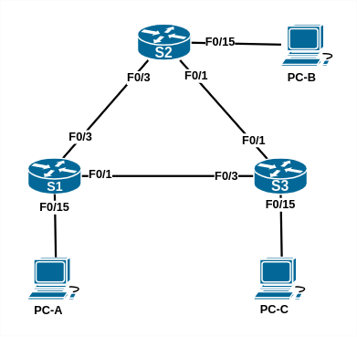

## Настройка расширенных сетей VLAN, VTP и DTP

###  Задачи:

    1. Настройка VTP
    2. Настройка DTP
    3. Добавление сетей VLAN и назначение портов
    4. Настройка расширенной сети VLAN

### Топология:


> Работа выполнена на оборудовании Termilab

### Таблица адресации:

| Устройство | Интерфейс     | IP-адрес     | Маска подсети   |
|:-----------|:--------------|:-------------|:----------------|
| S1         | VLAN 99       | 192.168.99.1 | 255.255.255.0   |
| S2         | VLAN 99       | 192.168.99.2 | 255.255.255.0   |
| S3         | VLAN 99       | 192.168.99.3 | 255.255.255.0   |
| PC-A       | NIC           | 192.168.10.1 | 255.255.255.0   |
| PC-B       | NIC           | 192.168.20.1 | 255.255.255.0   |
| PC-C       | NIC           | 192.168.10.2 | 255.255.255.0   |

## Часть 1. Настройка VTP

Вносим изменения в конфигурацию коммутаторов (предварительно приводим топологию коммутаторов в Termilab к указанной выше):
```
S1(config)#vtp domain CCNA
S1(config)#vtp mode client
S1(config)#vtp password cisco

S3(config)#vtp domain CCNA
S3(config)#vtp mode client
S3(config)#vtp password cisco

S2(config)#vtp domain CCNA
S2(config)#vtp mode server
S2(config)#vtp password cisco
```

Состояние VTP на коммутаторах после изменений:
```
S1#sh vtp status
VTP Version capable             : 1 to 3
VTP version running             : 1
VTP Domain Name                 : CCNA
VTP Pruning Mode                : Disabled
VTP Traps Generation            : Disabled
Device ID                       : 0008.302d.4580
Configuration last modified by 0.0.0.0 at 0-0-00 00:00:00
Feature VLAN:
--------------
VTP Operating Mode                : Client
Maximum VLANs supported locally   : 255
Number of existing VLANs          : 5
Configuration Revision            : 0
MD5 digest                        : 0x8B 0x58 0x3D 0x9D 0x64 0xBE 0xD5 0xF6 
                                    0x62 0xCB 0x4B 0x50 0xE5 0x9C 0x6F 0xF6 

S2#sh vtp status
VTP Version                     : 2
Configuration Revision          : 0
Maximum VLANs supported locally : 250
Number of existing VLANs        : 5
VTP Operating Mode              : Server
VTP Domain Name                 : CCNA
VTP Pruning Mode                : Disabled
VTP V2 Mode                     : Disabled
VTP Traps Generation            : Disabled
MD5 digest                      : 0x8B 0x58 0x3D 0x9D 0x64 0xBE 0xD5 0xF6 
Configuration last modified by 0.0.0.0 at 0-0-00 00:00:00
Local updater ID is 0.0.0.0 (no valid interface found)

S3#sh vtp status
VTP Version                     : 2
Configuration Revision          : 0
Maximum VLANs supported locally : 250
Number of existing VLANs        : 5
VTP Operating Mode              : Client
VTP Domain Name                 : CCNA
VTP Pruning Mode                : Disabled
VTP V2 Mode                     : Disabled
VTP Traps Generation            : Disabled
MD5 digest                      : 0x8B 0x58 0x3D 0x9D 0x64 0xBE 0xD5 0xF6 
Configuration last modified by 0.0.0.0 at 0-0-00 00:00:00
```

### Часть 2. Настройка DTP

#### Шаг 1. Настроиваем динамические магистральные каналы между S1 и S2.

При проверке текущего состояния каналов обнаруживается, что интерфейсы каналов на коммутаторах S1 и S3 находятся в состоянии auto, тогда как на S2 - в desirable.
Эта ситуация соответствует цели этого шага, поэтому оставляем конфигурацию интерфейсов без изменений.
Результаты проверки:
```
#sh interfaces trunk
Port        Mode             Encapsulation  Status        Native vlan
Fa0/1       auto             802.1q         trunking      1
Fa0/3       auto             802.1q         trunking      1
Port        Vlans allowed on trunk
Fa0/1       1-4094
Fa0/3       1-4094
Port        Vlans allowed and active in management domain
Fa0/1       1
Fa0/3       1
Port        Vlans in spanning tree forwarding state and not pruned
Fa0/1       1
Fa0/3       1

S2# sh interfaces trunk
Port        Mode         Encapsulation  Status        Native vlan
Fa0/1       desirable    802.1q         trunking      1
Fa0/3       desirable    802.1q         trunking      1
Port      Vlans allowed on trunk
Fa0/1       1-4094
Fa0/3       1-4094
Port        Vlans allowed and active in management domain
Fa0/1       1
Fa0/3       1
Port        Vlans in spanning tree forwarding state and not pruned
Fa0/1       none
Fa0/3       1

S3#sh interfaces trunk
Port        Mode         Encapsulation  Status        Native vlan
Fa0/1       auto         802.1q         trunking      1
Fa0/2       auto         802.1q         trunking      1
Port      Vlans allowed on trunk
Fa0/1       1-4094
Fa0/2       1-4094
Port        Vlans allowed and active in management domain
Fa0/1       1
Fa0/2       1
Port        Vlans in spanning tree forwarding state and not pruned
Fa0/1       1
Fa0/2       1
```


### Часть 3. Добавление сетей VLAN и назначение портов
### Часть 4. Настройка расширенной сети VLAN

