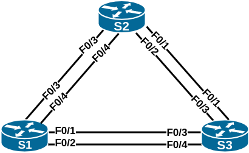

## Развертывание коммутируемой сети с резервными каналами

### Топология:


> Работа выполнена на оборудовании Termilab

### Таблица адресации:

| Устройство | Интерфейс | IP-адрес    | Маска подсети |
|:-----------|:--------------|:------------|:--------------|
| S1         | VLAN 1    | 192.168.1.1 | 255.255.255.0 |
| S2         | VLAN 1    | 192.168.1.2 | 255.255.255.0 |
| S3         | VLAN 1    | 192.168.1.3 | 255.255.255.0 |

## Часть 1. Создание сети и настройка основных параметров устройства

Файл изменений конфигурации коммутатора S1: [S1.conf](configs/S1_conf.txt)  
Файл изменений конфигурации коммутатора S2: [S2.conf](configs/S2_conf.txt)  
Файл изменений конфигурации коммутатора S3: [S3.conf](configs/S3_conf.txt)  

Настройки корректны, эхо-запросы успешны:  
```
S1#ping 192.168.1.2
Type escape sequence to abort.
Sending 5, 100-byte ICMP Echos to 192.168.1.2, timeout is 2 seconds:
.!!!!
Success rate is 80 percent (4/5), round-trip min/avg/max = 1/2/8 ms
S1#ping 192.168.1.3
Type escape sequence to abort.
Sending 5, 100-byte ICMP Echos to 192.168.1.3, timeout is 2 seconds:
!!!!!
Success rate is 100 percent (5/5), round-trip min/avg/max = 1/2/9 ms

S2#ping 192.168.1.1
Type escape sequence to abort.
Sending 5, 100-byte ICMP Echos to 192.168.1.1, timeout is 2 seconds:
!!!!!
Success rate is 100 percent (5/5), round-trip min/avg/max = 1/3/4 ms
S2#ping 192.168.1.3
Type escape sequence to abort.
Sending 5, 100-byte ICMP Echos to 192.168.1.3, timeout is 2 seconds:
.!!!!
Success rate is 80 percent (4/5), round-trip min/avg/max = 1/3/4 ms

S3#ping 192.168.1.1
Type escape sequence to abort.
Sending 5, 100-byte ICMP Echos to 192.168.1.1, timeout is 2 seconds:
.!!!!
Success rate is 80 percent (4/5), round-trip min/avg/max = 1/3/4 ms
S3#ping 192.168.1.2
Type escape sequence to abort.
Sending 5, 100-byte ICMP Echos to 192.168.1.2, timeout is 2 seconds:
!!!!!
Success rate is 100 percent (5/5), round-trip min/avg/max = 1/3/4 ms
```

## Часть 2. Определение корневого моста

Приводим настройку коммутаторов к требуемой (порты fa0/2 и fa0/4 в транковом режиме):

```
conf t
interface range fa0/1 - 4
shutdown
switchport mode trunk
interface fa0/2
no shutdown
interface fa0/4
no shutdown
end
```

Наблюдаем построение дерева STP. Результат:

```
S1#sh spanning-tree 
VLAN0001
  Spanning tree enabled protocol ieee
  Root ID    Priority    32769
             Address     0008.302d.4580
             This bridge is the root
             Hello Time   2 sec  Max Age 20 sec  Forward Delay 15 sec
  Bridge ID  Priority    32769  (priority 32768 sys-id-ext 1)
             Address     0008.302d.4580
             Hello Time   2 sec  Max Age 20 sec  Forward Delay 15 sec
             Aging Time  300 sec
Interface           Role Sts Cost      Prio.Nbr Type
------------------- ---- --- --------- -------- --------------------------------
Fa0/2               Desg FWD 19        128.2    P2p 
Fa0/4               Desg FWD 19        128.4    P2p 


S2#sh spanning-tree 
VLAN0001
  Spanning tree enabled protocol ieee
  Root ID    Priority    32769
             Address     0008.302d.4580
             Cost        19
             Port        4 (FastEthernet0/4)
             Hello Time   2 sec  Max Age 20 sec  Forward Delay 15 sec
  Bridge ID  Priority    32769  (priority 32768 sys-id-ext 1)
             Address     0015.fac1.4500
             Hello Time   2 sec  Max Age 20 sec  Forward Delay 15 sec
             Aging Time 300
Interface        Role Sts Cost      Prio.Nbr Type
---------------- ---- --- --------- -------- --------------------------------
Fa0/2            Altn BLK 19        128.2    P2p 
Fa0/4            Root FWD 19        128.4    P2p 


S3#sh spanning-tree 
VLAN0001
  Spanning tree enabled protocol ieee
  Root ID    Priority    32769
             Address     0008.302d.4580
             Cost        19
             Port        4 (FastEthernet0/4)
             Hello Time   2 sec  Max Age 20 sec  Forward Delay 15 sec
  Bridge ID  Priority    32769  (priority 32768 sys-id-ext 1)
             Address     0011.2142.4580
             Hello Time   2 sec  Max Age 20 sec  Forward Delay 15 sec
             Aging Time 300
Interface        Role Sts Cost      Prio.Nbr Type
---------------- ---- --- --------- -------- --------------------------------
Fa0/2            Desg FWD 19        128.2    P2p 
Fa0/4            Root FWD 19        128.4    P2p 
```

Объяснение к наблюдаемым выходным данным:

Приоритет моста 32769 = приоритету коммутатора 32768 (значение по умолчанию) + 1 (vlan id).  
Коммутатор S1 выбран корневым мостом, так как при равенстве приоритетов всех коммутаторов его мак-адрес наименьший.  
Порты коммутаторов S2 и S3, направленные в сторону S1 (к корню STP дерева), являются корневыми.  
Порт коммутаторов, направленные в противоположную корневому мосту сторону, являются назначенными.  
Порт fa0/2 коммутатора S2 выбран альтернативным, поскольку при равной стоимости расстояний S2-S3-S1 и S3-S2-S1 (19+19, для канала 100Mb/s стоимость равна 19) 
и приоритете портов 128.2 и 128.2, мак-адрес коммутатора S2 больше, чем мак-адрес S3.  


## Часть 3. Наблюдение за процессом выбора протоколом STP порта, исходя из стоимости портов

Уменьшаем стоимость порта fa0/4 до 18. Это увеличит его приоритет и должно привести к назначению альтернативным порт fa0/2 коммутатора S2.  
Что и наблюдаем в выводе:  
```
S2#conf t
Enter configuration commands, one per line.  End with CNTL/Z.
S2(config)#int fa0/4
S2(config-if)#spanning-tree cost 18
S2(config-if)#end
S2#sh spanning-tree 
01:38:40: %SYS-5-CONFIG_I: Configured from console by console
S2#sh spanning-tree 
VLAN0001
  Spanning tree enabled protocol ieee
  Root ID    Priority    32769
             Address     0008.302d.4580
             Cost        18
             Port        4 (FastEthernet0/4)
             Hello Time   2 sec  Max Age 20 sec  Forward Delay 15 sec
  Bridge ID  Priority    32769  (priority 32768 sys-id-ext 1)
             Address     0015.fac1.4500
             Hello Time   2 sec  Max Age 20 sec  Forward Delay 15 sec
             Aging Time 15 
Interface        Role Sts Cost      Prio.Nbr Type
---------------- ---- --- --------- -------- --------------------------------
Fa0/2            Desg LIS 19        128.2    P2p 
Fa0/4            Root FWD 18        128.4    P2p 

S3#sh spanning-tree 
VLAN0001
  Spanning tree enabled protocol ieee
  Root ID    Priority    32769
             Address     0008.302d.4580
             Cost        19
             Port        4 (FastEthernet0/4)
             Hello Time   2 sec  Max Age 20 sec  Forward Delay 15 sec
  Bridge ID  Priority    32769  (priority 32768 sys-id-ext 1)
             Address     0011.2142.4580
             Hello Time   2 sec  Max Age 20 sec  Forward Delay 15 sec
             Aging Time 15 
Interface        Role Sts Cost      Prio.Nbr Type
---------------- ---- --- --------- -------- --------------------------------
Fa0/2            Altn BLK 19        128.2    P2p 
Fa0/4            Root FWD 19        128.4    P2p 
```

>возвращаем стоимость порта к значению по умолчанию командой `no spanning-tree cost 18`

## Часть 4. Наблюдение за процессом выбора протоколом STP порта, исходя из приоритета портов

Включаем порты F0/1 и F0/3 на всех коммутаторах:  
```
conf t
interface fa0/1
no shutdown
interface fa0/3
no shutdown
end
```

Ждем пока дерево STP перестроится и фиксируем результат:  
```
S1#sh spanning-tree 
VLAN0001
  Spanning tree enabled protocol ieee
  Root ID    Priority    32769
             Address     0008.302d.4580
             This bridge is the root
             Hello Time   2 sec  Max Age 20 sec  Forward Delay 15 sec
  Bridge ID  Priority    32769  (priority 32768 sys-id-ext 1)
             Address     0008.302d.4580
             Hello Time   2 sec  Max Age 20 sec  Forward Delay 15 sec
             Aging Time  300 sec
Interface           Role Sts Cost      Prio.Nbr Type
------------------- ---- --- --------- -------- --------------------------------
Fa0/1               Desg FWD 19        128.1    P2p 
Fa0/2               Desg FWD 19        128.2    P2p 
Fa0/3               Desg FWD 19        128.3    P2p 
Fa0/4               Desg FWD 19        128.4    P2p 


S2#sh spanning-tree 
VLAN0001
  Spanning tree enabled protocol ieee
  Root ID    Priority    32769
             Address     0008.302d.4580
             Cost        19
             Port        3 (FastEthernet0/3)
             Hello Time   2 sec  Max Age 20 sec  Forward Delay 15 sec
  Bridge ID  Priority    32769  (priority 32768 sys-id-ext 1)
             Address     0015.fac1.4500
             Hello Time   2 sec  Max Age 20 sec  Forward Delay 15 sec
             Aging Time 300
Interface        Role Sts Cost      Prio.Nbr Type
---------------- ---- --- --------- -------- --------------------------------
Fa0/1            Altn BLK 19        128.1    P2p 
Fa0/2            Altn BLK 19        128.2    P2p 
Fa0/3            Root FWD 19        128.3    P2p 
Fa0/4            Altn BLK 19        128.4    P2p 


S3#sh spanning-tree 
VLAN0001
  Spanning tree enabled protocol ieee
  Root ID    Priority    32769
             Address     0008.302d.4580
             Cost        19
             Port        3 (FastEthernet0/3)
             Hello Time   2 sec  Max Age 20 sec  Forward Delay 15 sec
  Bridge ID  Priority    32769  (priority 32768 sys-id-ext 1)
             Address     0011.2142.4580
             Hello Time   2 sec  Max Age 20 sec  Forward Delay 15 sec
             Aging Time 300
Interface        Role Sts Cost      Prio.Nbr Type
---------------- ---- --- --------- -------- --------------------------------
Fa0/1            Desg FWD 19        128.1    P2p 
Fa0/2            Desg FWD 19        128.2    P2p 
Fa0/3            Root FWD 19        128.3    P2p 
Fa0/4            Altn BLK 19        128.4    P2p 
```

На некорневых коммутаторах S2 и S3 на каналах связи с S1 в качестве корневых были выбраны порты fa0/3, поскольку при прочих равных приоритет порта fa0/3 = 128.3 меньше, чем приоритет порта fa0/4 = 128.4

