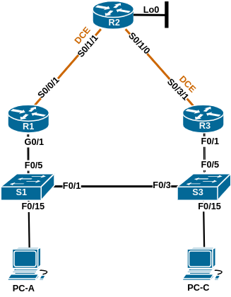

# Название лабораторной работы

### Топология:


### Таблица адресации:

| Устройство | Интерфейс     | IP-адрес     | Маска подсети   | Шлюз по умолчанию |
|:-----------|:--------------|:-------------|:----------------|:-----------------:|
| R1         | G0/1          | 192.168.1.1  | 255.255.255.0   | -                 |
|            | S0/0/1        | 10.1.1.1     | 255.255.255.252 | -                 |
| R2         | S0/1/1 (DCE)  | 10.1.1.2     | 255.255.255.252 | -                 |
|            | S0/1/0        | 10.2.2.2     | 255.255.255.252 | -                 |
|            | Lo0           | 209.165.200.225 | 255.255.255.254 | -              |
| R3         | G0/1          | 192.168.1.3  | 255.255.255.0   | -                 |
|            | S0/3/1        | 10.2.2.1     | 255.255.255.252 | -                 |
| S1         | VLAN1         | 192.168.1.11 | 255.255.255.0   | 192.168.1.1       |
| S3         | VLAN1         | 192.168.1.13 | 255.255.255.0   | 192.168.1.3       |
| PC-A       | NIC           | 192.168.1.31 | 255.255.255.0   | 192.168.1.1       |
| PC-B       | NIC           | 192.168.1.33 | 255.255.255.0   | 192.168.1.3       |

## Часть 1. Создание сети и настройка основных параметров устройства

Файл базовой настройки маршрутизатора R1: [R1.conf](configs/R1_conf.txt)  
Файл базовой настройки маршрутизатора R2: [R2.conf](configs/R2_conf.txt)  
Файл базовой настройки маршрутизатора R3: [R3.conf](configs/R3_conf.txt)  
Файл базовой настройки коммутатора S1: [S1.conf](configs/S1_conf.txt)  
Файл базовой настройки коммутатора S3: [S3.conf](configs/S3_conf.txt)

В результате получаем следующее состояние интерфейсов на устройствах:  
```
R1#sh int descr | i up
Gi0/1                          up             up       -- to S1
Se0/0/1                        up             up       -- to R2
R1#sh ip int br | i up
GigabitEthernet0/1         192.168.1.1     YES manual up                    up      
Serial0/0/1                10.1.1.1        YES manual up                    up      

R2#sh int descr | i up
Se0/1/0                        up             up       -- to R3
Se0/1/1                        up             up       -- to R1
Lo0                            up             up       -- Lo0
R2#sh ip int br | i up
Serial0/1/0                10.2.2.2        YES manual up                    up      
Serial0/1/1                10.1.1.2        YES manual up                    up      
Loopback0                  209.165.200.225 YES manual up                    up      

R3#sh int descr | i up
Fa0/1                          up             up       -- to S3
Se0/3/1                        up             up       -- to R2
R3#sh ip int br | i up
FastEthernet0/1            192.168.1.3     YES manual up                    up      
Serial0/3/1                10.2.2.1        YES manual up                    up      

S1#sh int descr | i up
Vl1                            up             up       
Fa0/1                          up             up       -- to S3 fa0/3
Fa0/5                          up             up       -- to R1 gi0/1
Fa0/15                         up             up       -- to PC-A
S1#sh ip int br | i up
Vlan1                  192.168.1.11    YES manual up                    up      
FastEthernet0/1        unassigned      YES unset  up                    up      
FastEthernet0/5        unassigned      YES unset  up                    up      
FastEthernet0/15       unassigned      YES unset  up                    up      

S3#sh int descr | i up
Vl1                            up             up       
Fa0/3                          up             up       -- to S1 fa0/1
Fa0/5                          up             up       -- to R3 fa0/1
Fa0/15                         up             up       -- to PC-C
S3#sh ip int br | i up
Vlan1                      192.168.1.13    YES manual up                    up      
FastEthernet0/3            unassigned      YES unset  up                    up      
FastEthernet0/5            unassigned      YES unset  up                    up      
FastEthernet0/15           unassigned      YES unset  up                    up      
```

Проверка доступности PC-C пингом с PC-A проходит успешно.
#### Переходим к настройке протокола маршрутизации RIPv2.

R1:  
```
router rip
network 192.168.1.0
network 10.1.1.0
```

R2:  
```
router rip
network 10.1.1.0
network 10.2.2.0
passive-interface lo0
default-information originate
```

R3:  
```
router rip
network 192.168.1.0
network 10.2.2.0
```

Проверка пингом от PC-A и PC-C до ip-адресов маршрутизаторов и друг друга проходит успешно.  
Но, если во время эхо-запросов от PC-A к R2 на R1 отключить интерфейс gi0/1, то несмотря на наличие физической связности мы в итоге получим  
Desctination host unreachable

#### Воспользуемся для обеспечения отказоустойчивости протоколом HSRP.

Так как командой tracert первым хопом с PC-A у нас откликается 192.168.1.1, а с PC-B - 192.168.1.3, то настройки standby проводим, 
соответственно, на интерфейсах gi0/1 и fa0/1 маршрутизаторов R1 и R3:  
```
R1(config)#int gi0/1
R1(config-if)#stand
R1(config-if)#standby version 2
R1(config-if)#standby 1 ip 192.168.1.254 
R1(config-if)#standby 1 priority 150
R1(config-if)#standby 1 preempt 
*Jun 15 02:47:43.079: %HSRP-5-STATECHANGE: GigabitEthernet0/1 Grp 1 state Standby -> Active
R1(config-if)#end
*Jun 15 02:47:49.019: %SYS-5-CONFIG_I: Configured from console by console
R1#sh standby 
GigabitEthernet0/1 - Group 1 (version 2)
  State is Active
    2 state changes, last state change 00:00:08
  Virtual IP address is 192.168.1.254
  Active virtual MAC address is 0000.0c9f.f001
    Local virtual MAC address is 0000.0c9f.f001 (v2 default)
  Hello time 3 sec, hold time 10 sec
    Next hello sent in 1.536 secs
  Preemption enabled
  Active router is local
  Standby router is unknown
  Priority 150 (configured 150)
  Group name is "hsrp-Gi0/1-1" (default)
R1#
```

```
R3(config)#int fa0/1
R3(config-if)#standby version 2
R3(config-if)#standby 1 ip 192.168.1.254
R3(config-if)#end
Jan  2 14:18:24.543: %SYS-5-CONFIG_I: Configured from console by console
Jan  2 14:18:40.383: %HSRP-5-STATECHANGE: FastEthernet0/1 Grp 1 state Speak -> Standby
R3#sh standby
FastEthernet0/1 - Group 1 (version 2)
  State is Standby
    1 state change, last state change 00:00:22
  Virtual IP address is 192.168.1.254
  Active virtual MAC address is 0000.0c9f.f001
    Local virtual MAC address is 0000.0c9f.f001 (v2 default)
  Hello time 3 sec, hold time 10 sec
    Next hello sent in 1.488 secs
  Preemption disabled
  Active router is 192.168.1.1, priority 150 (expires in 9.632 sec)
    MAC address is e8b7.484a.1101
  Standby router is local
  Priority 100 (default 100)
  Group name is "hsrp-Fa0/1-1" (default)
R3#
```

В выводе команды можно наблюдать виртуальный мак-адрес для 192.168.1.254, обращаем внимание на то, что он совпадает на обоих маршрутизаторах.  
Также отмечаем, что роль R1 - это активный маршрутизатор, роль R3 - резервный.  
Приоритет у R1 150, R3 - 100.


Проверяем работу HSRP пингом с PC-A отключением интерфейса gi0/1 на R1. Разорвали соединение, 
пинг прекратился. Меняем шлюз на PC-A и PC-C на 192.168.1.254 - пинг до 209.165.200.225 восстановился, успешен.
Смотрим состояние HSPR на маршрутизаторах:  
```
R1#sh standby br
                     P indicates configured to preempt.
                     |
Interface   Grp  Pri P State   Active          Standby         Virtual IP
Gi0/1       1    150 P Init    unknown         unknown         192.168.1.254

R3#sh standby br
                     P indicates configured to preempt.
                     |
Interface   Grp  Pri P State   Active          Standby         Virtual IP
Fa0/1       1    100   Active  local           unknown         192.168.1.254
```

Включаем интерфейс, ждем секунд 30 и наблюдаем восстановление состояния HSRP до первоначального:  
```
*Jun 15 02:58:32.531: %HSRP-5-STATECHANGE: GigabitEthernet0/1 Grp 1 state Standby -> Active
R1#sh standby br
                     P indicates configured to preempt.
                     |
Interface   Grp  Pri P State   Active          Standby         Virtual IP
Gi0/1       1    150 P Active  local           192.168.1.3     192.168.1.254

R3#
Jan  2 14:28:03.187: %HSRP-5-STATECHANGE: FastEthernet0/1 Grp 1 state Active -> Speak
R3#
Jan  2 14:28:13.287: %HSRP-5-STATECHANGE: FastEthernet0/1 Grp 1 state Speak -> Standby
R3#sh standby br
                     P indicates configured to preempt.
                     |
Interface   Grp  Pri P State   Active          Standby         Virtual IP
Fa0/1       1    100   Standby 192.168.1.1     local           192.168.1.254
R3#
```

Меняем приоритет на R3 на 200:  
```
R3#sh standby
FastEthernet0/1 - Group 1 (version 2)
  State is Standby
    4 state changes, last state change 00:03:39
  Virtual IP address is 192.168.1.254
  Active virtual MAC address is 0000.0c9f.f001
    Local virtual MAC address is 0000.0c9f.f001 (v2 default)
  Hello time 3 sec, hold time 10 sec
    Next hello sent in 0.624 secs
  Preemption disabled
  Active router is 192.168.1.1, priority 150 (expires in 9.744 sec)
    MAC address is e8b7.484a.1101
  Standby router is local
  Priority 200 (configured 200)
  Group name is "hsrp-Fa0/1-1" (default)
R3#
R3#sh standby br
                     P indicates configured to preempt.
                     |
Interface   Grp  Pri P State   Active          Standby         Virtual IP
Fa0/1       1    200   Standby 192.168.1.1     local           192.168.1.254
R3#
```

Роли маршрутизаторов не изменились.  
На R3 устанавливаем интерфейс активным:  
```
R3(config)#int fa0/1
R3(config-if)#standby 1 preempt 
R3(config-if)#end
R3#
Jan  2 14:33:45.855: %HSRP-5-STATECHANGE: FastEthernet0/1 Grp 1 state Standby -> Active
R3#conf t
Jan  2 14:33:46.883: %SYS-5-CONFIG_I: Configured from console by console
R3#sh standby br
                     P indicates configured to preempt.
                     |
Interface   Grp  Pri P State   Active          Standby         Virtual IP
Fa0/1       1    200 P Active  local           unknown         192.168.1.254
R3#sh standby br
                     P indicates configured to preempt.
                     |
Interface   Grp  Pri P State   Active          Standby         Virtual IP
Fa0/1       1    200 P Active  local           192.168.1.1     192.168.1.254
R3#
```

Наблюдаем смену ролей маршрутизаторов. Теперь R3 - активный маршрутизатор.
Пинг успешный!
