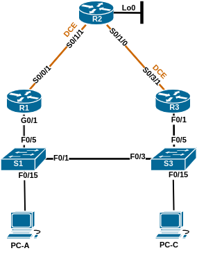

# Название лабораторной работы

### Топология:

### Таблица адресации:

| Устройство | Интерфейс     | IP-адрес     | Маска подсети   | Шлюз по умолчанию |
|:-----------|:--------------|:-------------|:----------------|:-----------------:|
| R1         | G0/1          | 192.168.1.1  | 255.255.255.0   | -                 |
|            | S0/0/1        | 10.1.1.1     | 255.255.255.252 | -                 |
| R2         | S0/1/1 (DCE)  | 10.1.1.2     | 255.255.255.252 | -                 |
|            | S0/1/0        | 10.2.2.2     | 255.255.255.252 | -                 |
|            | Lo0           | 209.165.200.225 | 255.255.255.254 | -              |
| R3         | G0/1          | 192.168.1.3  | 255.255.255.0   | -                 |
|            | S0/3/1        | 10.2.2.1     | 255.255.255.252 | -                 |
| S1         | VLAN1         | 192.168.1.11 | 255.255.255.0   | 192.168.1.1       |
| S3         | VLAN1         | 192.168.1.13 | 255.255.255.0   | 192.168.1.3       |
| PC-A       | NIC           | 192.168.1.31 | 255.255.255.0   | 192.168.1.1       |
| PC-B       | NIC           | 192.168.1.33 | 255.255.255.0   | 192.168.1.3       |

## Часть 1. Создание сети и настройка основных параметров устройства

Файл изменений конфигурации маршрутизатора R1: [R1.conf](configs/R1_conf.txt)  
Файл изменений конфигурации маршрутизатора R2: [R2.conf](configs/R2_conf.txt)  
Файл изменений конфигурации маршрутизатора R3: [R3.conf](configs/R3_conf.txt)  
Файл изменений конфигурации коммутатора S1: [S1.conf](configs/S1_conf.txt)  
Файл изменений конфигурации коммутатора S3: [S3.conf](configs/S3_conf.txt)

