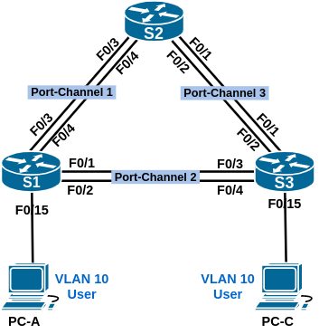

# Поиск и устранение неполадок в работе EtherChannel

### Топология:

### Таблица адресации:

| Устройство | Интерфейс     | IP-адрес      | Маска подсети   |
|:-----------|:--------------|:--------------|:----------------|
| S1         | VLAN99        | 192.168.1.11 | 255.255.255.0   |
| S2         | VLAN99        | 192.168.1.12 | 255.255.255.0   |
| S3         | VLAN99        | 192.168.1.13 | 255.255.255.0   |
| PC-A       | NIC           | 192.168.0.2  | 255.255.255.0   |
| PC-C       | NIC           | 192.168.0.3  | 255.255.255.0   |

## Часть 1. Создание сети и настройка основных параметров устройства

Файл изменений конфигурации маршрутизатора S1: [S1.conf](configs/S1_conf.txt)  
Файл изменений конфигурации маршрутизатора S2: [S2.conf](configs/S2_conf.txt)  
Файл изменений конфигурации маршрутизатора S3: [S3.conf](configs/S3_conf.txt)  

