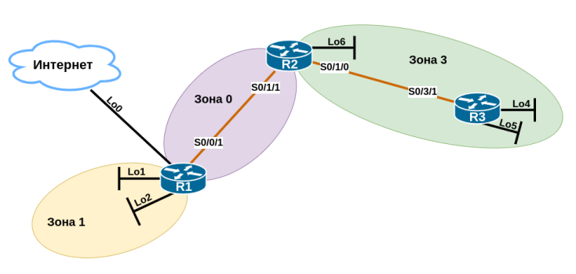

# Настройка базового протокола OSPFv2 для одной области

###  Задачи:

  1. Создание сети и настройка основных параметров устройства
  2. Настройка и проверка маршрутизации OSPF
  3. Изменение назначений идентификаторов маршрутизаторов
  4. Настройка пассивных интерфейсов OSPF
  5. Изменение метрик OSPF

### Топология:


### Таблица адресации:

| Устройство | Интерфейс     | IP-адрес     | Маска подсети      |
|:-----------|:--------------|:-------------|:-------------------|
| R1         | Se0/0/1       | 192.168.12.1 | 255.255.255.252    |
|            | Lo0           | 209.165.200.225 | 255.255.255.252 |
|            | Lo1           | 192.168.1.1  | 255.255.255.0      |
|            | Lo2           | 192.168.2.1  | 255.255.255.0      |
| R2         | Se0/1/1 (DCE) | 192.168.12.2 | 255.255.255.252    |
|            | Se0/1/0       | 192.168.23.1 | 255.255.255.252    |
|            | Lo6           | 192.168.6.1  | 255.255.255.0      |
| R3         | Se0/3/1 (DCE) | 192.168.23.2 | 255.255.255.252    |
|            | Lo4           | 192.168.4.1  | 255.255.255.0      |
|            | Lo5           | 192.168.5.1  | 255.255.255.0      |

## Часть 1. Создание сети и настройка основных параметров устройства.

##### Базовая настройка маршрутизаторов.

Файл изменений конфигурации маршрутизатора R1: [R1.conf](configs/R1_conf_part1.txt)  
Файл изменений конфигурации маршрутизатора R2: [R2.conf](configs/R2_conf_part1.txt)  
Файл изменений конфигурации маршрутизатора R3: [R3.conf](configs/R3_conf_part1.txt)

## Часть 2. Настройка сети OSPFv2 для нескольких областей.

##### Шаги 1-5. Настройка протокола OSPF, проверка правильности настройки.

Настройки маршрутизатора R1:  
```
R1#sh ip int br | i up
Serial0/0/1                192.168.12.1    YES manual up                    up      
Loopback0                  209.165.200.225 YES manual up                    up      
Loopback1                  192.168.1.1     YES manual up                    up      
Loopback2                  192.168.2.1     YES manual up                    up      

R1#sh run | s router
router ospf 1
 router-id 1.1.1.1
 passive-interface Loopback1
 passive-interface Loopback2
 network 192.168.1.0 0.0.0.255 area 1
 network 192.168.2.0 0.0.0.255 area 1
 network 192.168.12.0 0.0.0.3 area 0
```

Проверка настройки протокола OSPF на R1:  
```
R1#sh ip protocols
*** IP Routing is NSF aware ***
Routing Protocol is "ospf 1"
  Outgoing update filter list for all interfaces is not set
  Incoming update filter list for all interfaces is not set
  Router ID 1.1.1.1
  It is an area border router
  Number of areas in this router is 2. 2 normal 0 stub 0 nssa
  Maximum path: 4
  Routing for Networks:
    192.168.1.0 0.0.0.255 area 1
    192.168.2.0 0.0.0.255 area 1
    192.168.12.0 0.0.0.3 area 0
  Passive Interface(s):
    Loopback1
    Loopback2
  Routing Information Sources:
    Gateway         Distance      Last Update
    1.1.1.1              110      00:20:19
    2.2.2.2              110      00:02:17
  Distance: (default is 110)

R1#sh ip ospf nei
Neighbor ID     Pri   State           Dead Time   Address         Interface
2.2.2.2           0   FULL/  -        00:00:36    192.168.12.2    Serial0/0/1

R1#sh ip ospf int br
Interface    PID   Area            IP Address/Mask    Cost  State Nbrs F/C
Se0/0/1      1     0               192.168.12.1/30    781   P2P   1/1
Lo1          1     1               192.168.1.1/24     1     LOOP  0/0
Lo2          1     1               192.168.2.1/24     1     LOOP  0/0
```

Настройки маршрутизатора R2:  
```
R2#sh ip int br | i up
Serial0/1/0                192.168.23.1    YES manual up                    up      
Serial0/1/1                192.168.12.2    YES manual up                    up      
Loopback6                  192.168.6.1     YES manual up                    up      

R2#sh run | s router
router ospf 1
 router-id 2.2.2.2
 passive-interface Loopback6
 network 192.168.6.0 0.0.0.255 area 3
 network 192.168.12.0 0.0.0.3 area 0
 network 192.168.23.0 0.0.0.3 area 3
```

Проверка настройки протокола OSPF на R2:  
```
2#sh ip protocols
Routing Protocol is "ospf 1"
  Outgoing update filter list for all interfaces is not set
  Incoming update filter list for all interfaces is not set
  Router ID 2.2.2.2
  It is an area border router
  Number of areas in this router is 2. 2 normal 0 stub 0 nssa
  Maximum path: 4
  Routing for Networks:
    192.168.6.0 0.0.0.255 area 3
    192.168.12.0 0.0.0.3 area 0
    192.168.23.0 0.0.0.3 area 3
 Reference bandwidth unit is 100 mbps
  Passive Interface(s):
    Loopback6
  Routing Information Sources:
    Gateway         Distance      Last Update
    1.1.1.1              110      00:05:05
    3.3.3.3              110      00:07:43
  Distance: (default is 110)

R2#sh ip ospf nei
Neighbor ID     Pri   State           Dead Time   Address         Interface
1.1.1.1           0   FULL/  -        00:00:36    192.168.12.1    Serial0/1/1
3.3.3.3           0   FULL/  -        00:00:37    192.168.23.2    Serial0/1/0

R2#sh ip ospf int br
Interface    PID   Area            IP Address/Mask    Cost  State Nbrs F/C
Se0/1/1      1     0               192.168.12.2/30    781   P2P   1/1
Lo6          1     3               192.168.6.1/24     1     LOOP  0/0
Se0/1/0      1     3               192.168.23.1/30    781   P2P   1/1
R2#
```

Настройки маршрутизатора R3:  
```
R3#sh ip int br | i up
Serial0/3/1                192.168.23.2    YES NVRAM  up                    up      
Loopback4                  192.168.4.1     YES NVRAM  up                    up      
Loopback5                  192.168.5.1     YES NVRAM  up                    up      

R3#sh run | s router
router ospf 1
 router-id 3.3.3.3
 passive-interface Loopback4
 passive-interface Loopback5
 network 192.168.4.0 0.0.0.255 area 3
 network 192.168.5.0 0.0.0.255 area 3
 network 192.168.23.0 0.0.0.3 area 3
```

Проверка настройки протокола OSPF на R3:  
```
R3#sh ip protocols
*** IP Routing is NSF aware ***
Routing Protocol is "ospf 1"
  Outgoing update filter list for all interfaces is not set
  Incoming update filter list for all interfaces is not set
  Router ID 3.3.3.3
  Number of areas in this router is 1. 1 normal 0 stub 0 nssa
  Maximum path: 4
  Routing for Networks:
    192.168.4.0 0.0.0.255 area 3
    192.168.5.0 0.0.0.255 area 3
    192.168.23.0 0.0.0.3 area 3
  Passive Interface(s):
    Loopback4
    Loopback5
  Routing Information Sources:
    Gateway         Distance      Last Update
    2.2.2.2              110      00:06:25
  Distance: (default is 110)

R3#sh ip ospf nei
Neighbor ID     Pri   State           Dead Time   Address         Interface
2.2.2.2           0   FULL/  -        00:00:36    192.168.23.1    Serial0/3/1

R3#sh ip ospf int br
Interface    PID   Area            IP Address/Mask    Cost  State Nbrs F/C
Lo4          1     3               192.168.4.1/24     1     LOOP  0/0
Lo5          1     3               192.168.5.1/24     1     LOOP  0/0
Se0/3/1      1     3               192.168.23.2/30    781   P2P   1/1
```

* Граничные маршрутизаторы автономной системы (ASBR): R1
* Граничные маршрутизаторы области (ABR): R1, R2
* Внутренние маршрутизаторы: R3

##### Шаг 6. Настройка аутентификации MD5 для всех последовательных интерфейсов.

R1:  
```
int se0/0/1
ip ospf message-digest-key 1 md5 Cisco123
end
```

R2:  
```
int se0/1/0
ip ospf message-digest-key 1 md5 Cisco123
int se0/1/1
ip ospf message-digest-key 1 md5 Cisco123
end
```

R3:  
```
int se0/3/1
ip ospf message-digest-key 1 md5 Cisco123
end
```

Проверка работы OSPF после изменения типа аутентификации:  
```
R1#sh ip ospf nei
Neighbor ID     Pri   State           Dead Time   Address         Interface
2.2.2.2           0   FULL/  -        00:00:38    192.168.12.2    Serial0/0/1
R1#

R2#sh ip ospf nei
Neighbor ID     Pri   State           Dead Time   Address         Interface
1.1.1.1           0   FULL/  -        00:00:35    192.168.12.1    Serial0/1/1
3.3.3.3           0   FULL/  -        00:00:31    192.168.23.2    Serial0/1/0
R2#

R3#sh ip ospf nei
Neighbor ID     Pri   State           Dead Time   Address         Interface
2.2.2.2           0   FULL/  -        00:00:33    192.168.23.1    Serial0/3/1
R3#
```

## Часть 3. Настройка межобластных суммарных маршрутов.

Зафиксируем текущее состояние таблицы маршрутизации и базы данных LSDB на каждом маршрутизаторе:

R1:  
```
R1#sh ip route ospf | b Gateway
Gateway of last resort is 209.165.200.226 to network 0.0.0.0
      192.168.4.0/32 is subnetted, 1 subnets
O IA     192.168.4.1 [110/1563] via 192.168.12.2, 00:08:49, Serial0/0/1
      192.168.5.0/32 is subnetted, 1 subnets
O IA     192.168.5.1 [110/1563] via 192.168.12.2, 00:08:49, Serial0/0/1
      192.168.6.0/32 is subnetted, 1 subnets
O IA     192.168.6.1 [110/782] via 192.168.12.2, 00:08:49, Serial0/0/1
      192.168.23.0/30 is subnetted, 1 subnets
O IA     192.168.23.0 [110/1562] via 192.168.12.2, 00:08:49, Serial0/0/1

R1#show ip ospf database
            OSPF Router with ID (1.1.1.1) (Process ID 1)
Router Link States (Area 0)
Link ID         ADV Router      Age         Seq#       Checksum Link count
1.1.1.1         1.1.1.1         486         0x80000006 0x002DD8 2
2.2.2.2         2.2.2.2         245         0x80000004 0x00D032 2
Summary Net Link States (Area 0)
Link ID         ADV Router      Age         Seq#       Checksum
192.168.1.1     1.1.1.1         529         0x80000001 0x00AE1E
192.168.2.1     1.1.1.1         529         0x80000001 0x00A328
192.168.4.1     2.2.2.2         245         0x80000004 0x0007AB
192.168.5.1     2.2.2.2         682         0x80000005 0x00F9B6
192.168.6.1     2.2.2.2         245         0x80000004 0x00536D
192.168.23.0    2.2.2.2         245         0x80000004 0x002381
Router Link States (Area 1)
Link ID         ADV Router      Age         Seq#       Checksum Link count
1.1.1.1         1.1.1.1         625         0x80000009 0x0088AF 2
```

R2:  
```
R2#sh ip route ospf
     192.168.4.0/32 is subnetted, 1 subnets
O       192.168.4.1 [110/782] via 192.168.23.2, 01:45:31, Serial0/1/0
     192.168.5.0/32 is subnetted, 1 subnets
O       192.168.5.1 [110/782] via 192.168.23.2, 00:12:44, Serial0/1/0
     192.168.1.0/32 is subnetted, 1 subnets
O IA    192.168.1.1 [110/782] via 192.168.12.1, 00:10:05, Serial0/1/1
     192.168.2.0/32 is subnetted, 1 subnets
O IA    192.168.2.1 [110/782] via 192.168.12.1, 00:10:05, Serial0/1/1

R2#show ip ospf database
            OSPF Router with ID (2.2.2.2) (Process ID 1)
Router Link States (Area 0)
Link ID         ADV Router      Age         Seq#       Checksum Link count
1.1.1.1         1.1.1.1         564         0x80000006 0x002DD8 2
2.2.2.2         2.2.2.2         321         0x80000004 0x00D032 2
Summary Net Link States (Area 0)
Link ID         ADV Router      Age         Seq#       Checksum
192.168.1.1     1.1.1.1         607         0x80000001 0x00AE1E
192.168.2.1     1.1.1.1         607         0x80000001 0x00A328
192.168.4.1     2.2.2.2         321         0x80000004 0x0007AB
192.168.5.1     2.2.2.2         759         0x80000005 0x00F9B6
192.168.6.1     2.2.2.2         321         0x80000004 0x00536D
192.168.23.0    2.2.2.2         321         0x80000004 0x002381
Router Link States (Area 3)
Link ID         ADV Router      Age         Seq#       Checksum Link count
2.2.2.2         2.2.2.2         321         0x80000004 0x00DC87 3
```

R3:  
```
R3#sh ip route ospf | b Gateway
Gateway of last resort is not set
      192.168.1.0/32 is subnetted, 1 subnets
O IA     192.168.1.1 [110/1563] via 192.168.23.1, 00:10:38, Serial0/3/1
      192.168.2.0/32 is subnetted, 1 subnets
O IA     192.168.2.1 [110/1563] via 192.168.23.1, 00:10:38, Serial0/3/1
      192.168.6.0/32 is subnetted, 1 subnets
O        192.168.6.1 [110/782] via 192.168.23.1, 00:15:59, Serial0/3/1
      192.168.12.0/30 is subnetted, 1 subnets
O IA     192.168.12.0 [110/1562] via 192.168.23.1, 00:15:59, Serial0/3/1
R3#
R3#show ip ospf database
            OSPF Router with ID (3.3.3.3) (Process ID 1)
Router Link States (Area 3)
Link ID         ADV Router      Age         Seq#       Checksum Link count
2.2.2.2         2.2.2.2         354         0x80000004 0x00DC87 3
3.3.3.3         3.3.3.3         380         0x80000008 0x00D508 4
Summary Net Link States (Area 3)
Link ID         ADV Router      Age         Seq#       Checksum
192.168.1.1     2.2.2.2         639         0x80000001 0x002E8A
192.168.2.1     2.2.2.2         639         0x80000001 0x002394
192.168.12.0    2.2.2.2         354         0x80000004 0x009C13
```

Настраиваем суммарные маршруты для областей 1 и 3  
```
R1(config)# router ospf 1
R1(config-router)# area 1 range 192.168.0.0 255.255.252.0

R2(config)# router ospf 1
R2(config-router)# area 3 range 192.168.4.0 255.255.254.0
```

Посмотрим результат:  
```
R1#sh ip route ospf | b Gateway
Gateway of last resort is 209.165.200.226 to network 0.0.0.0
O     192.168.0.0/22 is a summary, 00:01:05, Null0
O IA  192.168.4.0/23 [110/1563] via 192.168.12.2, 00:00:27, Serial0/0/1
      192.168.6.0/32 is subnetted, 1 subnets
O IA     192.168.6.1 [110/782] via 192.168.12.2, 00:01:05, Serial0/0/1
      192.168.23.0/30 is subnetted, 1 subnets
O IA     192.168.23.0 [110/1562] via 192.168.12.2, 00:01:05, Serial0/0/1

R1#show ip ospf database
            OSPF Router with ID (1.1.1.1) (Process ID 1)
Router Link States (Area 0)
Link ID         ADV Router      Age         Seq#       Checksum Link count
1.1.1.1         1.1.1.1         696         0x80000006 0x002DD8 2
2.2.2.2         2.2.2.2         454         0x80000004 0x00D032 2
Summary Net Link States (Area 0)
Link ID         ADV Router      Age         Seq#       Checksum
192.168.0.0     1.1.1.1         64          0x80000001 0x00B41D
192.168.4.0     2.2.2.2         28          0x80000001 0x0012A5
192.168.6.1     2.2.2.2         454         0x80000004 0x00536D
192.168.23.0    2.2.2.2         454         0x80000004 0x002381
Router Link States (Area 1)
Link ID         ADV Router      Age         Seq#       Checksum Link count
1.1.1.1         1.1.1.1         835         0x80000009 0x0088AF 2
Summary Net Link States (Area 1)
  
```

```
R2#sh ip route ospf
     192.168.4.0/32 is subnetted, 1 subnets
O       192.168.4.1 [110/782] via 192.168.23.2, 00:00:46, Serial0/1/0
     192.168.5.0/32 is subnetted, 1 subnets
O       192.168.5.1 [110/782] via 192.168.23.2, 00:00:46, Serial0/1/0
O    192.168.4.0/23 is a summary, 00:00:46, Null0
O IA 192.168.0.0/22 [110/782] via 192.168.12.1, 00:00:46, Serial0/1/1

R2#show ip ospf database
            OSPF Router with ID (2.2.2.2) (Process ID 1)
Router Link States (Area 0)
Link ID         ADV Router      Age         Seq#       Checksum Link count
1.1.1.1         1.1.1.1         716         0x80000006 0x002DD8 2
2.2.2.2         2.2.2.2         473         0x80000004 0x00D032 2
Summary Net Link States (Area 0)
Link ID         ADV Router      Age         Seq#       Checksum
192.168.0.0     1.1.1.1         85          0x80000001 0x00B41D
192.168.4.0     2.2.2.2         46          0x80000001 0x0012A5
192.168.6.1     2.2.2.2         473         0x80000004 0x00536D
192.168.23.0    2.2.2.2         473         0x80000004 0x002381
Router Link States (Area 3)
Link ID         ADV Router      Age         Seq#       Checksum Link count
2.2.2.2         2.2.2.2         473         0x80000004 0x00DC87 3
3.3.3.3         3.3.3.3         501         0x80000008 0x00D508 4
```

```
R3#sh ip route ospf | b Gateway
Gateway of last resort is not set
O IA  192.168.0.0/22 [110/1563] via 192.168.23.1, 00:01:11, Serial0/3/1
      192.168.6.0/32 is subnetted, 1 subnets
O        192.168.6.1 [110/782] via 192.168.23.1, 00:17:46, Serial0/3/1
      192.168.12.0/30 is subnetted, 1 subnets
O IA     192.168.12.0 [110/1562] via 192.168.23.1, 00:17:46, Serial0/3/1
R3#
R3#show ip ospf database
            OSPF Router with ID (3.3.3.3) (Process ID 1)
Router Link States (Area 3)
Link ID         ADV Router      Age         Seq#       Checksum Link count
2.2.2.2         2.2.2.2         460         0x80000004 0x00DC87 3
3.3.3.3         3.3.3.3         486         0x80000008 0x00D508 4
Summary Net Link States (Area 3)
Link ID         ADV Router      Age         Seq#       Checksum
192.168.0.0     2.2.2.2         71          0x80000001 0x003489
192.168.12.0    2.2.2.2         460         0x80000004 0x009C13
```

В результирующих таблицах маршрутизации и базах данных LSDB маршрутизаторов наблюдаем уменьшение количества маршрутов и идентификаторов.  
Так маршруты 192.168.1.0/24 и 192.168.2.0/24 суммировались в 192.168.0.0/22, который представлен в базах данных идентификатором 192.168.0.0.  
А маршруты 192.168.4.0/24 и 192.168.5.0/24 суммировались в 192.168.4.0/23, который представлен в базах данных идентификатором 192.168.4.0.  

Корректность настроек подтверждается результатами эхо-запросов:  
```
R1#ping 192.168.4.1
Type escape sequence to abort.
Sending 5, 100-byte ICMP Echos to 192.168.4.1, timeout is 2 seconds:
!!!!!
Success rate is 100 percent (5/5), round-trip min/avg/max = 28/28/28 ms
R1#ping 192.168.5.1
Type escape sequence to abort.
Sending 5, 100-byte ICMP Echos to 192.168.5.1, timeout is 2 seconds:
!!!!!
Success rate is 100 percent (5/5), round-trip min/avg/max = 28/28/32 ms
R1#

R3#ping 192.168.1.1
Type escape sequence to abort.
Sending 5, 100-byte ICMP Echos to 192.168.1.1, timeout is 2 seconds:
!!!!!
Success rate is 100 percent (5/5), round-trip min/avg/max = 28/28/28 ms
R3#ping 192.168.2.1
Type escape sequence to abort.
Sending 5, 100-byte ICMP Echos to 192.168.2.1, timeout is 2 seconds:
!!!!!
Success rate is 100 percent (5/5), round-trip min/avg/max = 28/28/32 ms
R3#
```

