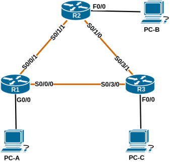

# Базовая настройка протокола EIGRP для IPv4

### Топология:


### Таблица адресации:

| Устройство | Интерфейс     | IP-адрес     | Маска подсети   | Шлюз по умолчанию |
|:-----------|:--------------|:-------------|:----------------|:-----------------:|
| R1         | Gi0/0         | 192.168.1.1  | 255.255.255.0   | -                 |
|            | Se0/0/1       | 10.1.1.1     | 255.255.255.252 | -                 |
|            | Se0/0/0       | 10.3.3.1     | 255.255.255.252 | -                 |
| R2         | Fa0/0         | 192.168.2.1  | 255.255.255.0   | -                 |
|            | Se0/1/1 (DCE) | 10.1.1.2     | 255.255.255.252 | -                 |
|            | Se0/1/0       | 10.2.2.2     | 255.255.255.252 | -                 |
| R3         | Fa0/0         | 192.168.3.1  | 255.255.255.0   | -                 |
|            | Se0/3/0 (DCE) | 10.3.3.2     | 255.255.255.252 | -                 |
|            | Se0/3/1 (DCE) | 10.2.2.1     | 255.255.255.252 | -                 |
| PC-A       | NIC           | 192.168.1.3  | 255.255.255.0   | 192.168.1.1       |
| PC-B       | NIC           | 192.168.2.3  | 255.255.255.0   | 192.168.2.1       |
| PC-C       | NIC           | 192.168.3.3  | 255.255.255.0   | 192.168.3.1       |

## Часть 1. Создание сети и настройка основных параметров устройства

Файл изменений конфигурации маршрутизатора R1: [R1.conf](configs/R1_conf_part1.txt)  
Файл изменений конфигурации маршрутизатора R2: [R2.conf](configs/R2_conf_part1.txt)  
Файл изменений конфигурации маршрутизатора R3: [R3.conf](configs/R3_conf_part1.txt)

Результат изменений:  
```
R1(config)#router eigrp 10
R1(config-router)#network 10.1.1.0 0.0.0.3
R1(config-router)#network 10.3.3.0 0.0.0.3
R1(config-router)#network 192.168.1.0 0.0.0.255

R2(config)#router eigrp 10
R2(config-router)#network 10.1.1.0 0.0.0.3
R2(config-router)#network 10.2.2.0 0.0.0.3
R2(config-router)#network 192.168.2.0 0.0.0.255

R3(config)#router eigrp 10
R3(config-router)#network 10.2.2.0 0.0.0.3
R3(config-router)#network 10.3.3.0 0.0.0.3
R3(config-router)#network 192.168.3.0 0.0.0.255
```

```
R1#show ip eigrp neighbors 
EIGRP-IPv4 Neighbors for AS(10)
H   Address                 Interface       Hold Uptime   SRTT   RTO  Q  Seq
                                            (sec)         (ms)       Cnt Num
1   10.3.3.2                Se0/0/0           12 00:03:31   17  1140  0  7
0   10.1.1.2                Se0/0/1           11 00:04:20   10  1140  0  9

R1#show ip route eigrp | b Gateway
Gateway of last resort is not set
      10.0.0.0/8 is variably subnetted, 5 subnets, 2 masks
D        10.2.2.0/30 [90/21024000] via 10.3.3.2, 00:04:57, Serial0/0/0
                     [90/21024000] via 10.1.1.2, 00:04:57, Serial0/0/1
D     192.168.2.0/24 [90/20514560] via 10.1.1.2, 00:04:57, Serial0/0/1
D     192.168.3.0/24 [90/20514560] via 10.3.3.2, 00:04:57, Serial0/0/0
```

```
R2#show ip eigrp neighbors 
IP-EIGRP neighbors for process 10
H   Address                 Interface       Hold Uptime   SRTT   RTO  Q  Seq
                                            (sec)         (ms)       Cnt Num
1   10.2.2.1                Se0/1/0           11 00:03:37   21  1140  0  6
0   10.1.1.1                Se0/1/1           14 00:04:26   12  1140  0  9

R2#show ip route eigrp
     10.0.0.0/8 is variably subnetted, 4 subnets, 2 masks
D       10.3.3.0/30 [90/21024000] via 10.2.2.1, 00:04:33, Serial0/1/0
                    [90/21024000] via 10.1.1.1, 00:04:33, Serial0/1/1
D       10.0.0.0/8 is a summary, 00:05:22, Null0
D    192.168.1.0/24 [90/20512256] via 10.1.1.1, 00:04:31, Serial0/1/1
D    192.168.3.0/24 [90/20514560] via 10.2.2.1, 00:04:31, Serial0/1/0
```

```
R3#show ip eigrp neighbors 
EIGRP-IPv4 Neighbors for AS(10)
H   Address                 Interface       Hold Uptime   SRTT   RTO  Q  Seq
                                            (sec)         (ms)       Cnt Num
1   10.3.3.1                Se0/3/0           11 00:03:41 1284  5000  0  10
0   10.2.2.2                Se0/3/1           10 00:03:41   21  1140  0  8

R3#show ip route eigrp | b Gateway
Gateway of last resort is not set
      10.0.0.0/8 is variably subnetted, 5 subnets, 2 masks
D        10.1.1.0/30 [90/21024000] via 10.3.3.1, 00:04:48, Serial0/3/0
                     [90/21024000] via 10.2.2.2, 00:04:48, Serial0/3/1
D     192.168.1.0/24 [90/20512256] via 10.3.3.1, 00:04:48, Serial0/3/0
D     192.168.2.0/24 [90/20514560] via 10.2.2.2, 00:04:48, Serial0/3/1
```


```
R1#show ip eigrp topology
EIGRP-IPv4 Topology Table for AS(10)/ID(192.168.1.1)
Codes: P - Passive, A - Active, U - Update, Q - Query, R - Reply,
       r - reply Status, s - sia Status 
P 192.168.3.0/24, 1 successors, FD is 20514560
        via 10.3.3.2 (20514560/28160), Serial0/0/0
P 192.168.2.0/24, 1 successors, FD is 20514560
        via 10.1.1.2 (20514560/28160), Serial0/0/1
P 10.2.2.0/30, 2 successors, FD is 21024000
        via 10.1.1.2 (21024000/20512000), Serial0/0/1
        via 10.3.3.2 (21024000/20512000), Serial0/0/0
P 10.3.3.0/30, 1 successors, FD is 20512000
        via Connected, Serial0/0/0
P 192.168.1.0/24, 1 successors, FD is 2816
        via Connected, GigabitEthernet0/0
P 10.1.1.0/30, 1 successors, FD is 20512000
        via Connected, Serial0/0/1
```

```
R2#show ip eigrp topology
IP-EIGRP Topology Table for AS(10)/ID(192.168.2.1)
Codes: P - Passive, A - Active, U - Update, Q - Query, R - Reply,
       r - reply Status, s - sia Status 
P 10.3.3.0/30, 2 successors, FD is 21024000
        via 10.1.1.1 (21024000/20512000), Serial0/1/1
        via 10.2.2.1 (21024000/20512000), Serial0/1/0
P 10.0.0.0/8, 1 successors, FD is 20512000
        via Summary (20512000/0), Null0
P 10.2.2.0/30, 1 successors, FD is 20512000
        via Connected, Serial0/1/0
P 10.1.1.0/30, 1 successors, FD is 20512000
        via Connected, Serial0/1/1
P 192.168.1.0/24, 1 successors, FD is 20512256
        via 10.1.1.1 (20512256/2816), Serial0/1/1
P 192.168.2.0/24, 1 successors, FD is 28160
        via Connected, FastEthernet0/0
P 192.168.3.0/24, 1 successors, FD is 20514560
        via 10.2.2.1 (20514560/28160), Serial0/1/0
```

```
R3#show ip eigrp topology
EIGRP-IPv4 Topology Table for AS(10)/ID(192.168.3.1)
Codes: P - Passive, A - Active, U - Update, Q - Query, R - Reply,
       r - reply Status, s - sia Status 
P 192.168.3.0/24, 1 successors, FD is 28160
        via Connected, FastEthernet0/0
P 192.168.2.0/24, 1 successors, FD is 20514560
        via 10.2.2.2 (20514560/28160), Serial0/3/1
P 10.2.2.0/30, 1 successors, FD is 20512000
        via Connected, Serial0/3/1
P 10.3.3.0/30, 1 successors, FD is 20512000
        via Connected, Serial0/3/0
P 192.168.1.0/24, 1 successors, FD is 20512256
        via 10.3.3.1 (20512256/2816), Serial0/3/0
P 10.1.1.0/30, 2 successors, FD is 21024000
        via 10.2.2.2 (21024000/20512000), Serial0/3/1
        via 10.3.3.1 (21024000/20512000), Serial0/3/0
```

```
R1#show ip protocols
*** IP Routing is NSF aware ***
Routing Protocol is "eigrp 10"
  Outgoing update filter list for all interfaces is not set
  Incoming update filter list for all interfaces is not set
  Default networks flagged in outgoing updates
  Default networks accepted from incoming updates
  Redistributing: eigrp 10
  EIGRP-IPv4 Protocol for AS(10)
    Metric weight K1=1, K2=0, K3=1, K4=0, K5=0
    NSF-aware route hold timer is 240
    Router-ID: 192.168.1.1
    Topology : 0 (base) 
      Active Timer: 3 min
      Distance: internal 90 external 170
      Maximum path: 4
      Maximum hopcount 100
      Maximum metric variance 1
  Automatic Summarization: disabled
  Maximum path: 4
  Routing for Networks:
    10.1.1.0/30
    10.3.3.0/30
    192.168.1.0
  Routing Information Sources:
    Gateway         Distance      Last Update
    10.3.3.2              90      00:09:12
    10.1.1.2              90      00:09:12
  Distance: internal 90 external 170
```

```
R2#show ip protocols
Routing Protocol is "eigrp 10"
  Outgoing update filter list for all interfaces is not set
  Incoming update filter list for all interfaces is not set
  Default networks flagged in outgoing updates
  Default networks accepted from incoming updates
  EIGRP metric weight K1=1, K2=0, K3=1, K4=0, K5=0
  EIGRP maximum hopcount 100
  EIGRP maximum metric variance 1
  Redistributing: eigrp 10
  EIGRP NSF-aware route hold timer is 240s
  Automatic network summarization is in effect
  Automatic address summarization:
    192.168.2.0/24 for Serial0/1/1, Serial0/1/0
    10.0.0.0/8 for FastEthernet0/0
      Summarizing with metric 20512000
  Maximum path: 4
  Routing for Networks:
    10.1.1.0/30
    10.2.2.0/30
    192.168.2.0
  Routing Information Sources:
    Gateway         Distance      Last Update
    (this router)         90      00:10:09
    10.2.2.1              90      00:09:20
    Gateway         Distance      Last Update
    10.1.1.1              90      00:09:21
  Distance: internal 90 external 170
```

```
R3#show ip protocols
*** IP Routing is NSF aware ***
Routing Protocol is "eigrp 10"
  Outgoing update filter list for all interfaces is not set
  Incoming update filter list for all interfaces is not set
  Default networks flagged in outgoing updates
  Default networks accepted from incoming updates
  EIGRP-IPv4 Protocol for AS(10)
    Metric weight K1=1, K2=0, K3=1, K4=0, K5=0
    NSF-aware route hold timer is 240
    Router-ID: 192.168.3.1
    Topology : 0 (base) 
      Active Timer: 3 min
      Distance: internal 90 external 170
      Maximum path: 4
      Maximum hopcount 100
      Maximum metric variance 1
  Automatic Summarization: disabled
  Maximum path: 4
  Routing for Networks:
    10.2.2.0/30
    10.3.3.0/30
    192.168.3.0
  Routing Information Sources:
    Gateway         Distance      Last Update
    10.2.2.2              90      00:09:26
    10.3.3.1              90      00:09:26
  Distance: internal 90 external 170
```

## Часть 4. Настройка пропускной способности и пассивных интерфейсов

```
R1(config)#int se0/0/1
R1(config-if)#bandwidth 2000
R1(config-if)#int se0/0/0
R1(config-if)#bandwidth 64
```

```
R1#sh interface se0/0/0
Serial0/0/0 is up, line protocol is up 
  Hardware is WIC MBRD Serial
  Description: -- to R3
  Internet address is 10.3.3.1/30
  MTU 1500 bytes, BW 64 Kbit/sec, DLY 20000 usec, 
     reliability 255/255, txload 1/255, rxload 1/255
  Encapsulation HDLC, loopback not set
  Keepalive set (10 sec)
  Last input 00:00:00, output 00:00:04, output hang never
  Last clearing of "show interface" counters never
  Input queue: 0/75/0/0 (size/max/drops/flushes); Total output drops: 0
  Queueing strategy: weighted fair
  Output queue: 0/1000/64/0 (size/max total/threshold/drops) 
     Conversations  0/1/32 (active/max active/max total)
     Reserved Conversations 0/0 (allocated/max allocated)
     Available Bandwidth 48 kilobits/sec
  5 minute input rate 0 bits/sec, 0 packets/sec
  5 minute output rate 0 bits/sec, 0 packets/sec
     449 packets input, 30927 bytes, 0 no buffer
     Received 208 broadcasts (215 IP multicasts)
     2 runts, 0 giants, 0 throttles
     2 input errors, 0 CRC, 0 frame, 0 overrun, 0 ignored, 0 abort
     449 packets output, 30630 bytes, 0 underruns
          
R1#sh interface se0/0/1
Serial0/0/1 is up, line protocol is up 
  Hardware is WIC MBRD Serial
  Description: -- to R2
  Internet address is 10.1.1.1/30
  MTU 1500 bytes, BW 2000 Kbit/sec, DLY 20000 usec, 
     reliability 255/255, txload 1/255, rxload 1/255
  Encapsulation HDLC, loopback not set
  Keepalive set (10 sec)
  Last input 00:00:02, output 00:00:00, output hang never
  Last clearing of "show interface" counters never
  Input queue: 0/75/0/0 (size/max/drops/flushes); Total output drops: 0
  Queueing strategy: weighted fair
  Output queue: 0/1000/64/0 (size/max total/threshold/drops) 
     Conversations  0/1/32 (active/max active/max total)
     Reserved Conversations 0/0 (allocated/max allocated)
     Available Bandwidth 1500 kilobits/sec
  5 minute input rate 0 bits/sec, 0 packets/sec
  5 minute output rate 0 bits/sec, 0 packets/sec
     620 packets input, 33776 bytes, 0 no buffer
     Received 365 broadcasts (226 IP multicasts)
     2 runts, 0 giants, 0 throttles
     2 input errors, 0 CRC, 0 frame, 0 overrun, 0 ignored, 0 abort
     644 packets output, 36379 bytes, 0 underruns
```


```
R1#sh ip route | b Gateway      
Gateway of last resort is not set
      10.0.0.0/8 is variably subnetted, 5 subnets, 2 masks
C        10.1.1.0/30 is directly connected, Serial0/0/1
L        10.1.1.1/32 is directly connected, Serial0/0/1
D        10.2.2.0/30 [90/21024000] via 10.1.1.2, 00:02:55, Serial0/0/1
C        10.3.3.0/30 is directly connected, Serial0/0/0
L        10.3.3.1/32 is directly connected, Serial0/0/0
      192.168.1.0/24 is variably subnetted, 2 subnets, 2 masks
C        192.168.1.0/24 is directly connected, GigabitEthernet0/0
L        192.168.1.1/32 is directly connected, GigabitEthernet0/0
D     192.168.2.0/24 [90/1794560] via 10.1.1.2, 00:02:55, Serial0/0/1
D     192.168.3.0/24 [90/21026560] via 10.1.1.2, 00:02:55, Serial0/0/1
```


```
R2(config)#int se0/1/1
R2(config-if)#bandwidth 2000
R2(config-if)#int se0/1/0   
R2(config-if)#bandwidth 2000

R3(config)#int se0/3/1  
R3(config-if)#bandwidth 2000
R3(config-if)#int se0/3/0   
R3(config-if)#bandwidth 64  
```

```
R2#sh ip route | b Gateway
Gateway of last resort is not set
     10.0.0.0/8 is variably subnetted, 4 subnets, 2 masks
D       10.3.3.0/30 [90/41024000] via 10.2.2.1, 00:00:51, Serial0/1/0
                    [90/41024000] via 10.1.1.1, 00:00:51, Serial0/1/1
C       10.2.2.0/30 is directly connected, Serial0/1/0
C       10.1.1.0/30 is directly connected, Serial0/1/1
D       10.0.0.0/8 is a summary, 00:02:30, Null0
D    192.168.1.0/24 [90/1792256] via 10.1.1.1, 00:01:02, Serial0/1/1
C    192.168.2.0/24 is directly connected, FastEthernet0/0
D    192.168.3.0/24 [90/1794560] via 10.2.2.1, 00:02:22, Serial0/1/0

R3#sh ip route | b Gateway
Gateway of last resort is not set
      10.0.0.0/8 is variably subnetted, 5 subnets, 2 masks
D        10.1.1.0/30 [90/2304000] via 10.2.2.2, 00:00:09, Serial0/3/1
C        10.2.2.0/30 is directly connected, Serial0/3/1
L        10.2.2.1/32 is directly connected, Serial0/3/1
C        10.3.3.0/30 is directly connected, Serial0/3/0
L        10.3.3.2/32 is directly connected, Serial0/3/0
D     192.168.1.0/24 [90/2304256] via 10.2.2.2, 00:00:09, Serial0/3/1
D     192.168.2.0/24 [90/1794560] via 10.2.2.2, 00:00:09, Serial0/3/1
      192.168.3.0/24 is variably subnetted, 2 subnets, 2 masks
C        192.168.3.0/24 is directly connected, FastEthernet0/0
L        192.168.3.1/32 is directly connected, FastEthernet0/0
```


```
R1(config)#router eigrp 10
R1(config-router)#passive-interface gi0/0

R2(config)#router eigrp 10
R2(config-router)#passive-interface fa0/0

R3(config)#router eigrp 10
R3(config-router)#passive-interface fa0/0
```

```
R1#show ip protocols
*** IP Routing is NSF aware ***
Routing Protocol is "eigrp 10"
  Outgoing update filter list for all interfaces is not set
  Incoming update filter list for all interfaces is not set
  Default networks flagged in outgoing updates
  Default networks accepted from incoming updates
  Redistributing: eigrp 10
  EIGRP-IPv4 Protocol for AS(10)
    Metric weight K1=1, K2=0, K3=1, K4=0, K5=0
    NSF-aware route hold timer is 240
    Router-ID: 192.168.1.1
    Topology : 0 (base) 
      Active Timer: 3 min
      Distance: internal 90 external 170
      Maximum path: 4
      Maximum hopcount 100
      Maximum metric variance 1
  Automatic Summarization: disabled
  Maximum path: 4
  Routing for Networks:
    10.1.1.0/30
    10.3.3.0/30
    192.168.1.0
  Passive Interface(s):
    GigabitEthernet0/0
  Routing Information Sources:
    Gateway         Distance      Last Update
    10.3.3.2              90      00:05:50
    10.1.1.2              90      00:01:27
  Distance: internal 90 external 170
```

```
R2#show ip protocols
Routing Protocol is "eigrp 10"
  Outgoing update filter list for all interfaces is not set
  Incoming update filter list for all interfaces is not set
  Default networks flagged in outgoing updates
  Default networks accepted from incoming updates
  EIGRP metric weight K1=1, K2=0, K3=1, K4=0, K5=0
  EIGRP maximum hopcount 100
  EIGRP maximum metric variance 1
  Redistributing: eigrp 10
  EIGRP NSF-aware route hold timer is 240s
  Automatic network summarization is in effect
  Automatic address summarization:
    192.168.2.0/24 for Serial0/1/1, Serial0/1/0
  Maximum path: 4
  Routing for Networks:
    10.1.1.0/30
    10.2.2.0/30
    192.168.2.0
  Passive Interface(s):
    FastEthernet0/0
  Routing Information Sources:
    Gateway         Distance      Last Update
    (this router)         90      00:07:33
    Gateway         Distance      Last Update
    10.2.2.1              90      00:01:31
    10.1.1.1              90      00:01:31
  Distance: internal 90 external 170
```

```
R3#show ip protocols
*** IP Routing is NSF aware ***
Routing Protocol is "eigrp 10"
  Outgoing update filter list for all interfaces is not set
  Incoming update filter list for all interfaces is not set
  Default networks flagged in outgoing updates
  Default networks accepted from incoming updates
  EIGRP-IPv4 Protocol for AS(10)
    Metric weight K1=1, K2=0, K3=1, K4=0, K5=0
    NSF-aware route hold timer is 240
    Router-ID: 192.168.3.1
    Topology : 0 (base) 
      Active Timer: 3 min
      Distance: internal 90 external 170
      Maximum path: 4
      Maximum hopcount 100
      Maximum metric variance 1
  Automatic Summarization: disabled
  Maximum path: 4
  Routing for Networks:
    10.2.2.0/30
    10.3.3.0/30
    192.168.3.0
  Passive Interface(s):
    FastEthernet0/0
  Routing Information Sources:
    Gateway         Distance      Last Update
    10.2.2.2              90      00:01:37
    10.3.3.1              90      00:06:01
  Distance: internal 90 external 170
```

