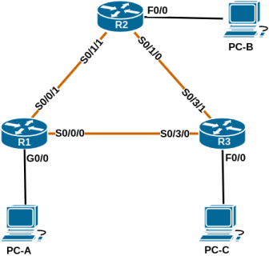

# Название лабораторной работы

### Топология:

### Таблица адресации:

| Устройство | Интерфейс     | IP-адрес     | Маска подсети   | Шлюз по умолчанию |
|:-----------|:--------------|:-------------|:----------------|:-----------------:|
| R1         | Gi0/0         | xxx.yyy.w.z  | 255.255.255.0   | -                 |

## Часть 1. Создание сети и настройка основных параметров устройства

Файл изменений конфигурации маршрутизатора R1: [R1.conf](configs/R1_conf_part1.txt)  
Файл изменений конфигурации маршрутизатора R2: [R2.conf](configs/R2_conf_part1.txt)  
Файл изменений конфигурации маршрутизатора R3: [R3.conf](configs/R3_conf_part1.txt)

