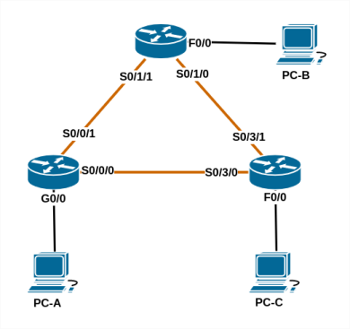

# Настройка базового протокола OSPFv2 для одной области

###  Задачи:

  1. Создание сети и настройка основных параметров устройства
  2. Настройка и проверка маршрутизации OSPF
  3. Изменение назначений идентификаторов маршрутизаторов
  4. Настройка пассивных интерфейсов OSPF
  5. Изменение метрик OSPF

### Таблица адресации:

| Устройство | Интерфейс     | IP-адрес     | Маска подсети   | Шлюз по умолчанию |
|:-----------|:--------------|:-------------|:----------------|:-----------------:|
| R1         | Gi0/0         | 192.168.1.1  | 255.255.255.0   | -                 |
|            | Se0/0/1       | 192.168.12.1 | 255.255.255.252 | -                 |
|            | Se0/0/0       | 192.168.13.1 | 255.255.255.252 | -                 |
| R2         | Fa0/0         | 192.168.2.1  | 255.255.255.0   | -                 |
|            | Se0/1/1 (DCE) | 192.168.12.2 | 255.255.255.252 | -                 |
|            | Se0/1/0       | 192.168.23.1 | 255.255.255.252 | -                 |
| R3         | Fa0/0         | 192.168.3.1  | 255.255.255.0   | -                 |
|            | Se0/3/0 (DCE) | 192.168.13.2 | 255.255.255.252 | -                 |
|            | Se0/3/1 (DCE) | 192.168.23.2 | 255.255.255.252 | -                 |
| PC-A       | NIC           | 192.168.1.3  | 255.255.255.0   | 192.168.1.1       |
| PC-B       | NIC           | 192.168.2.3  | 255.255.255.0   | 192.168.2.1       |
| PC-C       | NIC           | 192.168.3.3  | 255.255.255.0   | 192.168.3.1       |

### Топология:
